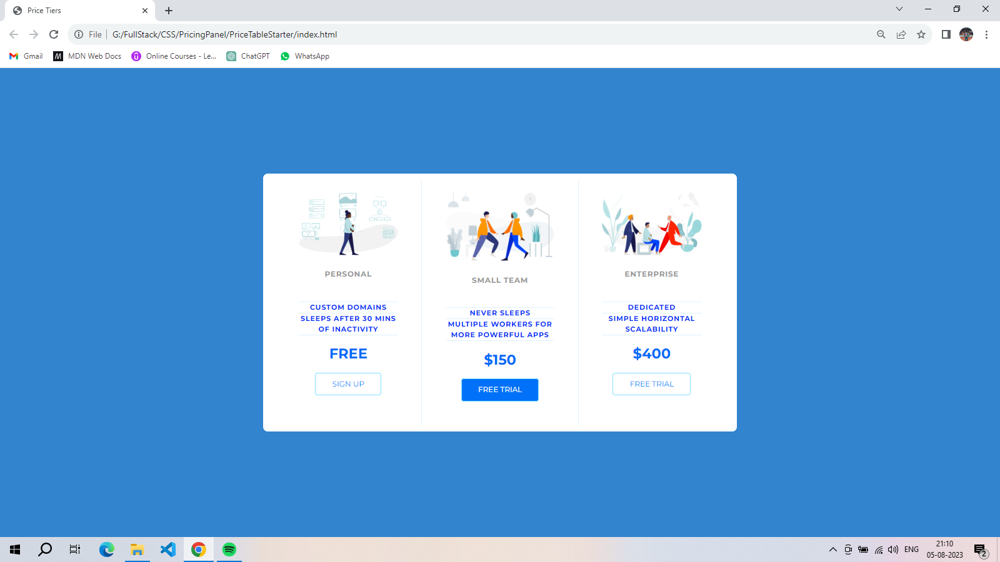
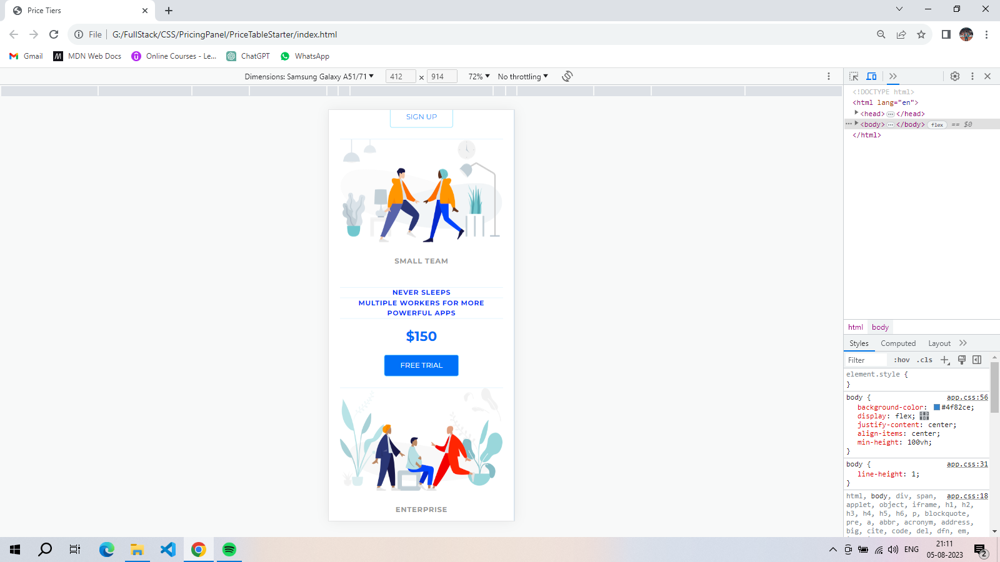

#Description
Subscription Plans is a single-page website showcasing three different subscription plans with their features and prices. This responsive design ensures a seamless experience on both mobile and desktop devices. The project is written using CSS, providing a clean and visually appealing layout for users to compare and choose the best plan for their needs.

#Features
1.Responsive design for optimal viewing on various devices (desktop, tablet, mobile).
2.Three distinct subscription plans with detailed features and pricing information.
3.Clean and modern layout for easy plan comparison.
4.Smooth transitions and animations for enhanced user experience.
5.Easy-to-understand pricing table.

#Usage
1.Clone this repository or download and extract the zip to your local machine.
2.Open index.html in your preferred web browser

#Credits
This project was inspired by and adapted from a CodePen user Travis williamson (https://codepen.io/travisw)

